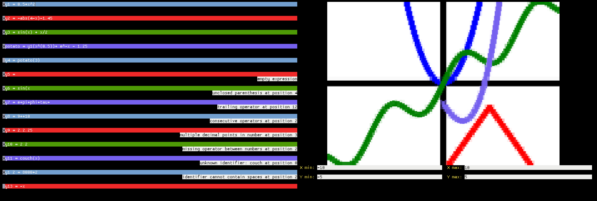
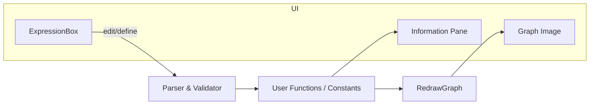

# Calculaterm — Terminal Graphing Calculator



[](https://github.com/CouchPugtato/calculaterm/actions)
[](https://github.com/CouchPugtato/calculaterm/commits/main)
[](go.mod)

## Table of Contents
- [Overview](#overview)
- [Architecture / Design](#architecture--design)
- [Quick Start / Installation](#quick-start--installation)
- [Usage](#usage)
- [Configuration](#configuration)
- [Project Layout](#project-layout)
- [Roadmap](#roadmap)
- [Contributing](#contributing)
- [Troubleshooting / FAQ](#troubleshooting--faq)

## Overview
Calculaterm is a TUI-based graphing calculator that lets you define functions and constants, visualize them in a live graph, all offline and inside your terminal.

Key features:
- Interactive expression rows with enable/disable toggles and per-function colors
- Built-in math functions: sin, cos, tan, sqrt, ln, exp, abs, asin, acos, atan
- User-defined functions and constants with validation and helpful error messages
- Numerical derivatives via an intuitive syntax: `d/dx(<expression>)`
- Adjustable graph bounds (X min/max, Y min/max) with immediate redraw
- Information pane for messages and feedback

## Architecture / Design
The app is composed of three main UI areas: an Expression Field Panel, a Graph with controls, and an Information panel. Expressions are tokenized, validated, and turned into callable functions before enabled functions are plotted in the graph image.



## Quick Start / Installation
Prerequisites:
- Go 1.23+ (see go.mod)
- Terminal with TrueColor support (recommended)

Install from source:
```
git clone https://github.com/CouchPugtato/calculaterm.git
cd calculaterm
go run .
```

Install as a binary:
```
go install github.com/CouchPugtato/calculaterm@latest
```
Then run: `calculaterm`

## Usage
CLI:
- Start the app: `go run .` (or `calculaterm` if installed)
- Enter expressions in the top panel, e.g. `y = sin(x)`
- Toggle function visibility via the checkbox
- Adjust graph bounds via the Graph Controls (X/Y min/max)

Library (advanced):
```go
package main
import (
  "fmt"
  modules "github.com/CouchPugtato/calculaterm/modules"
)
func main() {
  f, err := modules.CreateFunction("sin(x) + cos(x)")
  if err != nil { panic(err) }
  y, err := f(0.5)
  fmt.Println(y)

  df, err := modules.Derivative("sin(x)")
  if err != nil { panic(err) }
  dy, err := df(0.5)
  fmt.Println(dy)
}
```

## Configuration
While there are no external config files, several defaults can be tuned in code:

| Setting | Default | Location |
|---|---:|---|
| Graph flex weight | 16 | calculaterm.go (GraphSize) |
| Controls flex weight | 5 | calculaterm.go (`controlsSize = graphSize / 3`) |
| Information flex weight | 8 | calculaterm.go (`informationSize = graphSize / 2`) |
| X min | -10.0 | modules/graph.go |
| X max | 10.0 | modules/graph.go |
| Y min | -5.0 | modules/graph.go |
| Y max | 5.0 | modules/graph.go |

## Project Layout
```
calculaterm/
├── calculaterm.go          # Main TUI layout and application boot
├── modules/
│   ├── expressions.go      # Expression rows, parsing, validation, user funcs/constants
│   ├── graph.go            # Graph image rendering and X/Y bounds controls
│   └── information.go      # Information pane for messages
├── go.mod / go.sum         # Module metadata and dependencies
├── LICENSE                 # MIT License
└── README.md               # Project documentation
```

## Roadmap
- Improve focus background color handling for expression fields
- Allow robust negative number handling and unary minus edge cases
- Format response text consistently in expression rows
- Optional graph tick marks/labels visibility and scaling
- Zoom/pan controls and mouse interaction enhancements
- Save/load expression sets; export rendered graph image

## Contributing
Contributions are welcome!

- Code style: `gofmt` / `go vet`
- CI checks: build and basic lint


## Troubleshooting / FAQ

1. Identifier rules: No spaces within the name; cannot redefine `x` or built-ins; errors are shown in a error reporting field.
2. Bounds validation: `X min < X max` and `Y min < Y max`; invalid inputs show messages.
3. Graph not updating after resize: wait until the terminal stops resizing; it will redraw.
4. Color/focus oddities: expression background focus is being refined (known issue).
